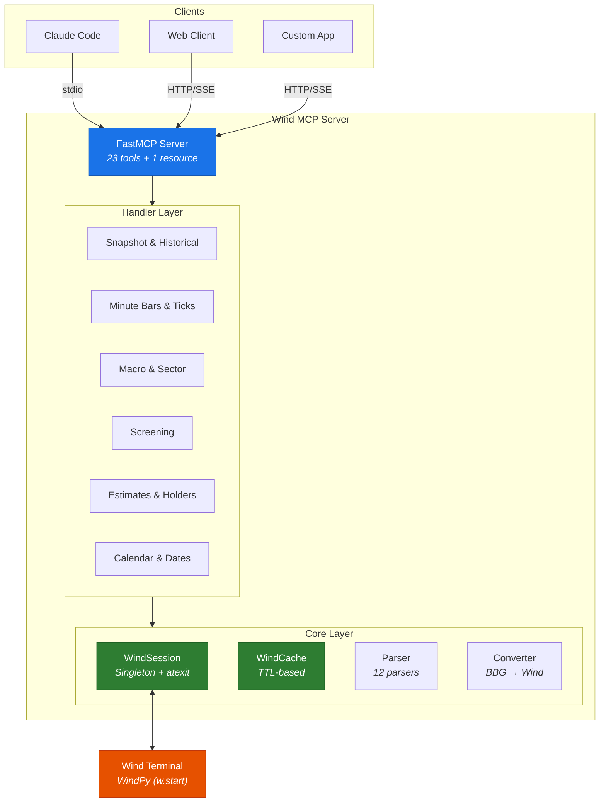
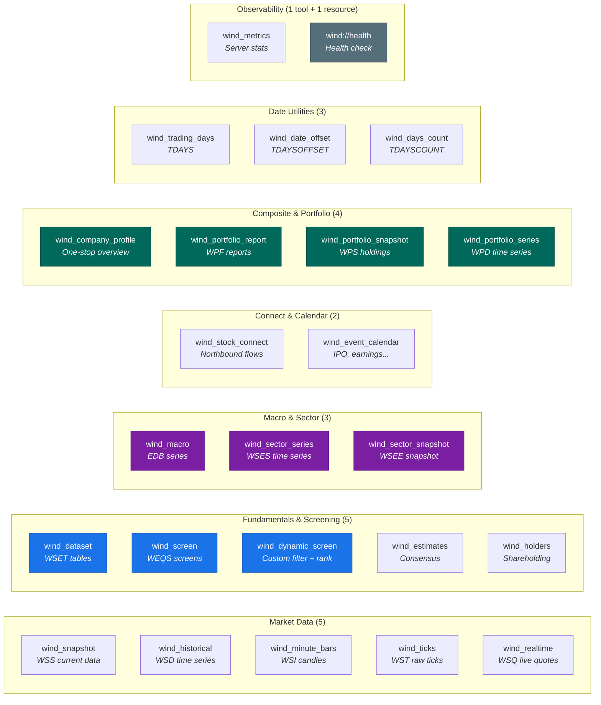
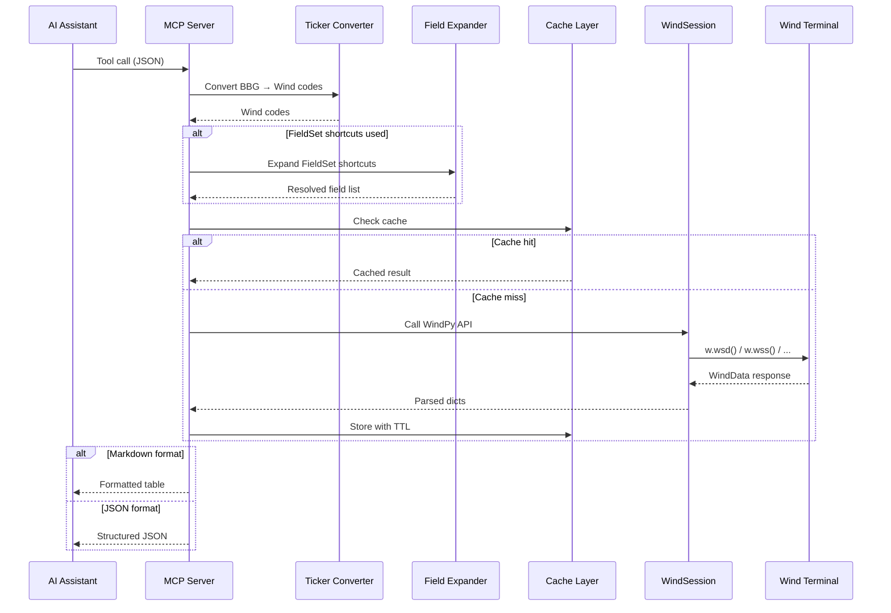
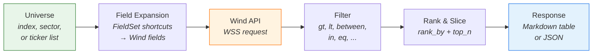
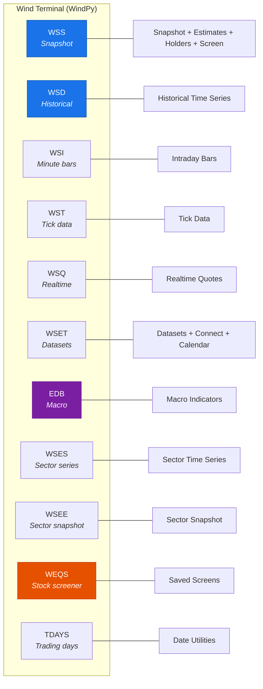

# Wind MCP

A Model Context Protocol server that gives AI assistants direct access to Wind Financial Terminal data.

[](https://opensource.org/licenses/MIT)
[](https://www.python.org/downloads/)
[](https://modelcontextprotocol.io)

---

Wind MCP bridges the Wind Financial Terminal (万得) with AI assistants via the [Model Context Protocol](https://modelcontextprotocol.io). It exposes **23 tools + 1 resource** covering market data, fundamentals, macro economics, screening, estimates, portfolio management, and date utilities — all accessible through natural language.

> **Platform:** Windows only (WindPy is a Windows COM-based library).

> Companion project to [Bloomberg-MCP](https://github.com/QmQsun/Bloomberg-MCP). Same architecture, same philosophy — but for Wind (万得).

```
You: "拉一下贵州茅台过去20天的量价数据"

Claude: runs wind_historical with codes=600519.SH, fields=close,volume
        → Returns structured price/volume time series

You: "Find me A-share stocks with PE < 15 and ROE > 20%"

Claude: runs wind_dynamic_screen with universe=A-shares, filters, rank
        → Returns filtered and ranked stock list
```

## Architecture



## Tools Overview (23 tools + 1 resource)



## Key Features

- **Bloomberg → Wind Ticker Converter** — Accepts Bloomberg-style identifiers (`AAPL US Equity`, `700 HK Equity`, `601012 CH Equity`) and auto-converts to Wind codes (`AAPL.O`, `00700.HK`, `601012.SH`). Covers US, HK, JP, LN, CH equities, indices, commodities, and currencies.
- **Modular architecture** — server.py is a thin entry point. Handlers, models, formatters, parsers, and converters cleanly separated.
- **16 FieldSet shortcuts** — Pre-defined field collections (PRICE, VALUATION, PROFITABILITY, etc.) that expand to Wind field mnemonics.
- **Cache layer** — TTL-based in-memory cache with data-type-aware expiration (30s for realtime, 24h for static).
- **12 WindPy parsers** — Handle WSS, WSD, WSI, WST, WSQ, WSET, EDB, WSES, WSEE, TDAYS, TDAYSOFFSET, TDAYSCOUNT with NaN→None cleanup and column-to-row transposition.
- **Dynamic Screening** — Custom filtering with operators (gt, lt, between, in, eq) + ranking + slicing, without knowing Wind mnemonics.

## Data Flow



## Tool Reference

### Market Data

| Tool | WindPy API | Description | Key Parameters |
|------|-----------|-------------|----------------|
| `wind_snapshot` | WSS | Current field values for any security | `codes`, `fields`, `trade_date` |
| `wind_historical` | WSD | Time series with configurable periodicity | `codes`, `fields`, `begin_date`, `end_date` |
| `wind_minute_bars` | WSI | OHLCV intraday candles (1/3/5/15/30/60 min) | `codes`, `fields`, `begin_time`, `end_time`, `bar_size` |
| `wind_ticks` | WST | Raw tick-level trade data | `codes`, `fields`, `begin_time`, `end_time` |
| `wind_realtime` | WSQ | Live streaming quotes | `codes`, `fields` |

### Fundamentals & Screening

| Tool | WindPy API | Description | Key Parameters |
|------|-----------|-------------|----------------|
| `wind_dataset` | WSET | Structured datasets (index members, IPOs, etc.) | `table_name`, `options` |
| `wind_screen` | WEQS | Execute saved Wind stock screens | `screen_name`, `options` |
| `wind_dynamic_screen` | WSS | Custom filter + rank + slice | `universe`, `fields`, `filters`, `rank_by`, `top_n` |
| `wind_estimates` | WSS | Consensus estimates and target prices | `codes`, `metrics`, `year` |
| `wind_holders` | WSS/WSET | Top holders, institutional, fund holdings | `codes`, `holder_type`, `date` |

### Macro & Sector

| Tool | WindPy API | Description | Key Parameters |
|------|-----------|-------------|----------------|
| `wind_macro` | EDB | Macroeconomic indicator time series | `codes`, `begin_date`, `end_date` |
| `wind_sector_series` | WSES | Sector-level time series | `codes`, `fields`, `begin_date`, `end_date` |
| `wind_sector_snapshot` | WSEE | Sector-level current snapshot | `codes`, `fields`, `trade_date` |

### Stock Connect & Calendar

| Tool | WindPy API | Description | Key Parameters |
|------|-----------|-------------|----------------|
| `wind_stock_connect` | WSET/WSS | Northbound/Southbound flow data | `codes`, `direction`, `date` |
| `wind_event_calendar` | WSET | IPO, earnings, dividend calendars | `event_type`, `begin_date`, `end_date` |

### Composite & Portfolio

| Tool | WindPy API | Description | Key Parameters |
|------|-----------|-------------|----------------|
| `wind_company_profile` | WSS+WSD | One-stop company overview (snapshot + estimates + price history) | `codes` |
| `wind_portfolio_report` | WPF | Portfolio performance/attribution/risk reports | `product_name`, `table_name`, `options` |
| `wind_portfolio_snapshot` | WPS | Portfolio NAV, holdings, weights, PnL | `portfolio_name`, `fields`, `options` |
| `wind_portfolio_series` | WPD | Portfolio performance time series | `portfolio_name`, `fields`, `begin_date` |

### Observability

| Tool | Type | Description |
|------|------|-------------|
| `wind_metrics` | Tool | Server metrics: tool call counts, latency, cache hit rate, uptime |
| `wind://health` | Resource | Wind connection and cache health status |

### Date Utilities

| Tool | WindPy API | Description | Key Parameters |
|------|-----------|-------------|----------------|
| `wind_trading_days` | TDAYS | List trading days in a range | `begin_date`, `end_date`, `calendar` |
| `wind_date_offset` | TDAYSOFFSET | Offset a date by N trading days | `date`, `offset`, `calendar` |
| `wind_days_count` | TDAYSCOUNT | Count trading days between two dates | `begin_date`, `end_date`, `calendar` |

All tools support `response_format`: `"markdown"` (default) or `"json"`.

## FieldSet Shortcuts

Instead of remembering Wind field mnemonics, use shorthand names that expand to multiple fields.

| FieldSet | Fields | Key Wind Mnemonics |
|----------|--------|-------------------|
| `PRICE` | 5 | close, open, high, low, pct_chg |
| `MOMENTUM` | 4 | pct_chg, pct_chg_5d, pct_chg_1m, pct_chg_ytd |
| `VOLUME_PROFILE` | 4 | volume, amt, turn, free_turn |
| `VALUATION` | 5 | pe_ttm, pb_lf, ps_ttm, pcf_ocf_ttm, ev2_to_ebitda |
| `VALUATION_EXTENDED` | 9 | + pe_est, dividend_yield, total_mkt_cap, ev |
| `PROFITABILITY` | 6 | roe_ttm, roa_ttm, grossprofitmargin, netprofitmargin, operatingprofitmargin, roic |
| `GROWTH` | 4 | yoyprofit, yoyrevenue, yoyocf, qfa_yoygr |
| `BALANCE_SHEET` | 6 | debttoassets, current_ratio, quick_ratio, cashflow_to_debt, longdebttodebt, equity_ratio |
| `CASH_FLOW` | 5 | ocfps, fcf, cf_from_ops, capex, dividendps |
| `TECHNICAL` | 5 | rsi, macd, vol_20d, beta_100w, atr_14d |
| `ANALYST` | 4 | rating_avg, est_target_price, est_eps_fy1, est_net_profit_fy1 |
| `ESTIMATE_REVISIONS` | 4 | est_eps_chg_4w, est_eps_chg_13w, est_num_up, est_num_down |
| `SECTOR` | 2 | industry_sw, industry_sw_lv2 |
| `NORTHBOUND` | 4 | sh_hk_share_pct, sh_hk_share_chg, sh_hk_share_amt, sh_hk_share_rank |
| `MARGIN` | 3 | margin_buy_bal, margin_sell_bal, margin_net_bal |
| `RISK` | 5 | beta_100w, volatility_20d, volatility_60d, sharpe_20d, max_drawdown_1y |
| `SCREENING_FULL` | 50+ | All of the above combined |

## Bloomberg → Wind Ticker Conversion

Wind MCP automatically converts Bloomberg-style identifiers to Wind codes:

| Bloomberg Format | Wind Code | Market |
|-----------------|-----------|--------|
| `AAPL US Equity` | `AAPL.O` | US (NASDAQ) |
| `JPM US Equity` | `JPM.N` | US (NYSE) |
| `700 HK Equity` | `00700.HK` | Hong Kong |
| `7203 JP Equity` | `7203.T` | Japan |
| `VOD LN Equity` | `VOD.L` | London |
| `601012 CH Equity` | `601012.SH` | A-share (Shanghai) |
| `000001 CH Equity` | `000001.SZ` | A-share (Shenzhen) |
| `300750 CH Equity` | `300750.SZ` | A-share (ChiNext) |
| `SPX Index` | `SPX.GI` | Index |
| `HSI Index` | `HSI.HI` | Index |
| `CL1 Comdty` | `CL.NYM` | Commodity |
| `EURUSD Curncy` | `EURUSD.FX` | Currency |
| `600519.SH` | `600519.SH` | Passthrough (already Wind) |

## Dynamic Screening

Build custom screens with pre-validated field sets, filters, and ranking — no need to know Wind field mnemonics.



### Filter Operators

| Operator | Description | Example |
|----------|-------------|---------|
| `gt` / `gte` | Greater than (or equal) | `{"field": "roe_ttm", "op": "gt", "value": 20}` |
| `lt` / `lte` | Less than (or equal) | `{"field": "pe_ttm", "op": "lt", "value": 15}` |
| `eq` / `neq` | Equals / not equals | `{"field": "industry_sw", "op": "eq", "value": "电子"}` |
| `between` | Range (inclusive) | `{"field": "pe_ttm", "op": "between", "value": [10, 25]}` |
| `in` | Value in list | `{"field": "industry_sw", "op": "in", "value": ["电子", "计算机"]}` |

### Example: Find Undervalued High-ROE A-shares

```json
{
  "universe": "sector:全部A股",
  "fields": ["PRICE", "VALUATION", "PROFITABILITY"],
  "filters": [
    {"field": "pe_ttm", "op": "lt", "value": 15},
    {"field": "roe_ttm", "op": "gt", "value": 20}
  ],
  "rank_by": "roe_ttm",
  "rank_descending": true,
  "top_n": 20
}
```

## Cache Layer

Built-in cache reduces Wind API load with data-type-aware TTLs:

| Data Type | Default TTL | Rationale |
|-----------|-------------|-----------|
| Realtime quotes (WSQ) | 30 seconds | Near real-time |
| Snapshot (WSS) | 5 minutes | Moderate refresh |
| Minute bars (WSI) | 5 minutes | Intraday refresh |
| Ticks (WST) | 1 minute | High-frequency |
| Portfolio (WPF/WPS/WPD) | 5 minutes | Moderate refresh |
| Screening (WEQS) | 10 minutes | Moderate refresh |
| Estimates | 4 hours | Consensus updates infrequently |
| Historical (WSD) | 12 hours | End-of-day data stable |
| Macro data (EDB) | 24 hours | Periodic updates |
| Dataset (WSET) | 24 hours | Reference data |
| Sector (WSES/WSEE) | 24 hours | Rarely changes |
| Holders / Dates | 24 hours | Rarely changes |

All TTLs are configurable via `wind_mcp.toml` or environment variables. See [Configuration](#configuration).

## Configuration

Server behavior can be customized via `wind_mcp.toml` in the project root. All values can also be overridden via environment variables with the prefix `WIND_MCP_` (e.g., `WIND_MCP_CACHE_MAXSIZE=5000`).

```toml
[session]
connect_timeout = 30        # Seconds to wait for Wind connection
reconnect_retries = 3       # Auto-reconnect attempts
reconnect_backoff = 1.0     # Backoff multiplier between retries

[cache]
maxsize = 2000              # Max cached entries (LRU eviction)
ttl_realtime = 30           # WSQ — near real-time
ttl_snapshot = 300          # WSS — 5 min
ttl_historical = 43200     # WSD — 12 hours
ttl_dataset = 86400        # WSET — 24 hours
ttl_macro = 86400          # EDB — 24 hours
ttl_portfolio = 300        # WPF/WPS/WPD — 5 min

[api]
timeout = 30.0              # Per-call timeout (seconds)
retries = 2                 # Retry count on transient errors
backoff = 1.0               # Backoff multiplier

[log]
format = "text"             # "json" or "text"
level = "INFO"
```

## Project Structure

```
wind-mcp/
├── pyproject.toml
├── README.md
├── LICENSE
├── wind_mcp.toml                  # Server configuration (cache TTL, timeouts, retries)
├── run_server.bat / run_server.ps1
├── src/wind_mcp/
│   ├── __init__.py
│   ├── __main__.py
│   ├── server.py                  # FastMCP entry point, 23 tools + 1 resource
│   ├── formatters.py              # Markdown table & JSON output
│   ├── core/
│   │   ├── session.py             # WindSession singleton + reconnect
│   │   ├── cache.py               # TTL cache with LRU eviction
│   │   ├── parser.py              # 12 WindData parsers
│   │   ├── converter.py           # Bloomberg → Wind ticker converter
│   │   ├── executor.py            # Single-thread executor for Wind API calls
│   │   ├── validators.py          # Input validation (codes, dates, fields)
│   │   ├── resilience.py          # Timeout, retry, stale-cache fallback
│   │   ├── config.py              # Centralized config (env > toml > defaults)
│   │   ├── metrics.py             # Counters + histograms for observability
│   │   ├── universe.py            # Universe resolution (index/sector → security list)
│   │   └── filters.py             # In-memory data filtering (gt/lt/between/in/...)
│   ├── models/
│   │   ├── enums.py               # ResponseFormat, Periodicity, etc.
│   │   └── inputs.py              # Pydantic input models
│   ├── tools/
│   │   ├── fieldsets.py           # 16 FieldSet definitions
│   │   └── field_expander.py      # FieldSet → field list resolver
│   ├── handlers/                  # 16 handler modules
│   │   ├── snapshot.py            # WSS
│   │   ├── historical.py          # WSD
│   │   ├── minute_bars.py         # WSI
│   │   ├── ticks.py               # WST
│   │   ├── realtime.py            # WSQ
│   │   ├── dataset.py             # WSET
│   │   ├── macro.py               # EDB
│   │   ├── sector.py              # WSES / WSEE
│   │   ├── screening.py           # WEQS + dynamic screen
│   │   ├── estimates.py           # Consensus estimates
│   │   ├── holders.py             # Holder analysis
│   │   ├── stock_connect.py       # Northbound/Southbound
│   │   ├── calendar.py            # Event calendar
│   │   ├── dates.py               # TDAYS / TDAYSOFFSET / TDAYSCOUNT
│   │   ├── composite.py           # Company profile (multi-source)
│   │   └── portfolio.py           # WPF / WPS / WPD portfolio tools
│   └── data/                      # Static mapping files
│       ├── us_exchange_map.json   # ~200 US tickers → exchange
│       ├── index_map.json         # BBG → Wind index mapping
│       ├── commodity_map.json     # BBG → Wind commodity mapping
│       └── currency_map.json      # BBG → Wind currency mapping
├── tests/                         # 101 unit tests (no Wind needed)
│   ├── test_parser.py
│   ├── test_fieldsets.py
│   ├── test_cache.py
│   ├── test_config.py
│   ├── test_converter.py
│   ├── test_filters.py
│   ├── test_formatters.py
│   ├── test_inputs.py
│   ├── test_metrics.py
│   ├── test_resilience.py
│   └── test_validators.py
└── examples/
    ├── basic_usage.py
    └── screening_example.py
```

## Installation

### Prerequisites

- **Windows** (WindPy is a Windows COM-based library)
- Python 3.10+ (must match Wind Terminal bitness — typically 64-bit)
- **Wind Financial Terminal (万得) running and logged in** (iWind or WFT)
- **WindPy** — installed via Wind Terminal, NOT via pip. Open Wind Terminal → click "Repair" or install the WindPy plugin from the Tools menu.

### Verify WindPy

Before installing Wind MCP, verify that WindPy works in your Python environment:

```python
python -c "from WindPy import w; w.start(); print(w.isconnected())"
# Should print: True
```

If this returns `False` or errors, fix your WindPy installation first. Common issues:
- Wind Terminal not running / not logged in
- Python bitness mismatch (e.g., 32-bit Python with 64-bit Wind)
- WindPy not installed (repair via Wind Terminal)

### Install

```bash
# From source
git clone https://github.com/QmQsun/Wind-MCP.git
cd Wind-MCP
pip install .            # standard install
# or: pip install -e .   # editable mode (for development)

# Or from PyPI
pip install wind-mcp
```

### Configure Claude Code

Add a `.mcp.json` file to register the MCP server. Two options:

**Global** (all projects can use Wind MCP) — place at `~/.mcp.json` (i.e., `C:\Users\<you>\.mcp.json`):

```json
{
  "mcpServers": {
    "wind-mcp": {
      "command": "wind-mcp",
      "args": []
    }
  }
}
```

**Project-level** (only one project) — place `.mcp.json` in the project root directory.

> The `wind-mcp` command is the console entry point installed by pip. Alternatively, use `"command": "python", "args": ["-m", "wind_mcp.server"]`.

## Quick Start

### As an MCP Server

```bash
# stdio (default — for Claude Code)
python -m wind_mcp.server

# HTTP transport (for web clients)
python -m wind_mcp.server --http --port=8080

# SSE transport (for streaming clients)
python -m wind_mcp.server --sse --port=8080
```

### Windows

```bash
# Command Prompt
run_server.bat

# PowerShell
.\run_server.ps1
```

## Wind API Coverage



## Contributing

Contributions welcome! Please open an issue or submit a pull request.

```bash
pip install -e ".[dev]"
pytest                    # Unit tests (no Wind Terminal needed)
black src/ tests/
ruff check src/ tests/
```

## Related Projects

- [Bloomberg-MCP](https://github.com/QmQsun/Bloomberg-MCP) — Same architecture for Bloomberg Terminal

## License

MIT — see [LICENSE](LICENSE) for details.
